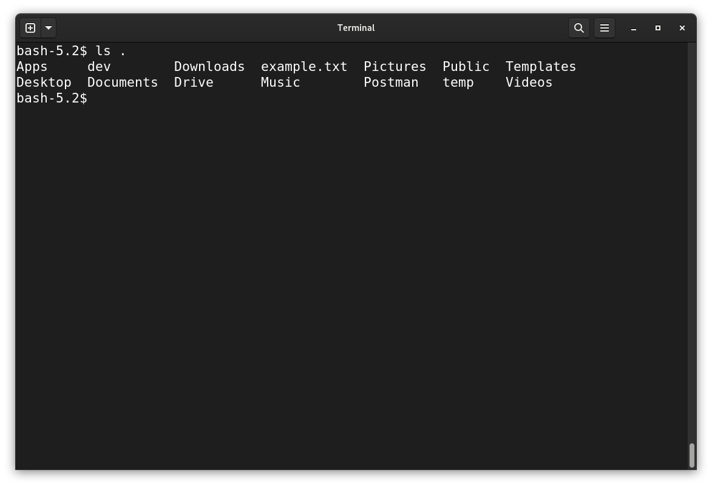
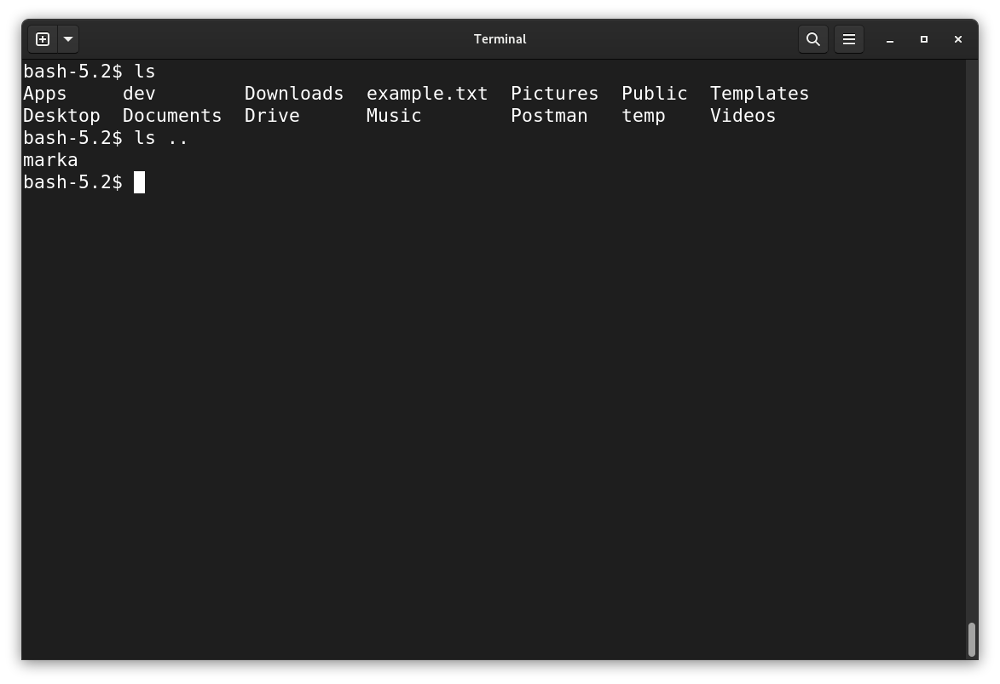

# Shell Expansions

## Brace Expansions `{}`

Braces can expand both arbitrary tokens and numeric sequences:

### arbitrary tokens

`touch {this,is,fun}.txt`

> creates:
>
> - this.txt
> - is.txt
> - fun.txt

### numeric sequences

Braces can expand a sequence of type `{x..y[..incr]}`, where `x` and `y` are integers or letters, and `incr` is an (optiona) increment integer value. For instance:

`touch file{1..5}.txt`

`touch file{a..e}.txt`

## Tilde Expansions `~`

Tilde expansion is a simple shortcut for the `$HOME` directory; for instance, for any given `{username}`:

`cd /home/{username}/Downloads`

is the same as:

`cd ~/Downloads`

> going back to some directory in the `$HOME` scope (e.g. `~/Downloads`), or even just back to `$HOME` itself (`~/`) is a very common task - learn this pattern well!
>
> hint - an even shorter way to navigate back to home is to just enter `cd` with no arguments; bash assumed you want to return to the `$HOME` directory.

## Directory Expansions `.` `..`

>the current directory

`.`

>the directory above the current one; its parent directory

`..`

