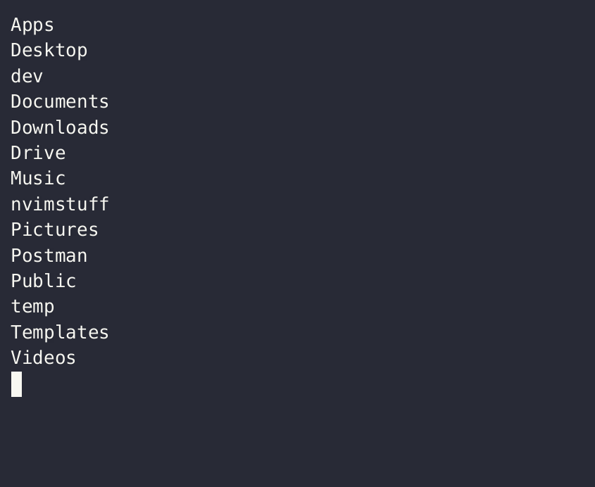

# Shell Expansions and Substitutions

## Brace Expansions `{}`

Braces can expand both arbitrary tokens and numeric sequences:

### arbitrary tokens

`touch {this,is,fun}.txt`

> creates:
>
> - this.txt
> - is.txt
> - fun.txt

### Numeric Sequences Expansions

Braces can expand a sequence of type `{x..y[..incr]}`, where `x` and `y` are integers or letters, and `incr` is an (optiona) increment integer value. For instance:

`touch file{1..5}.txt`

`touch file{a..e}.txt`

## Tilde Expansions `~`

Tilde expansion is a simple shortcut for the `$HOME` directory; for instance, for any given `{username}`:

`cd /home/{username}/Downloads`

is the same as:

`cd ~/Downloads`

> going back to some directory in the `$HOME` scope (e.g. `~/Downloads`), or even just back to `$HOME` itself (`~/`) is a very common task - learn this pattern well!
>
> hint - an even shorter way to navigate back to home is to just enter `cd` with no arguments; bash assumed you want to return to the `$HOME` directory.

## Directory Expansions `.` `..`

`.`

>the current directory

`..`

>the directory above the current one; its parent directory

## History Expansions

Some useful history expansions:

### quick replacement

> `^{that}^{this}`, where `{that}` is text from the prior command, and `{this}` is what it will be replaced with.

### previous command

`!!`

> run the previous command again; for instance, of you forget sudo:

### last argument of previous command

`!$`

> use last argument again with a separate command; a very common pattern

## Command Substitution

If a [subshell](subshells.md) construct is preceeded by `$`, it becomes subject to `command substitution`; under these conditions, the subshell is run first, and its output replaces the command itself. This highly useful pattern allows completion expressions to become subexpressions for the main shell scope (see an [example](for.md#for-i-in-range)).