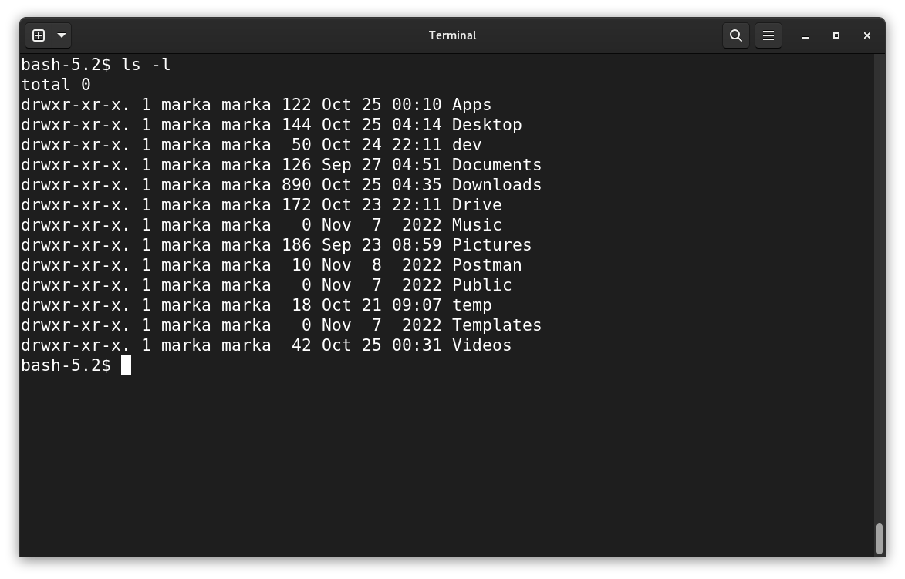
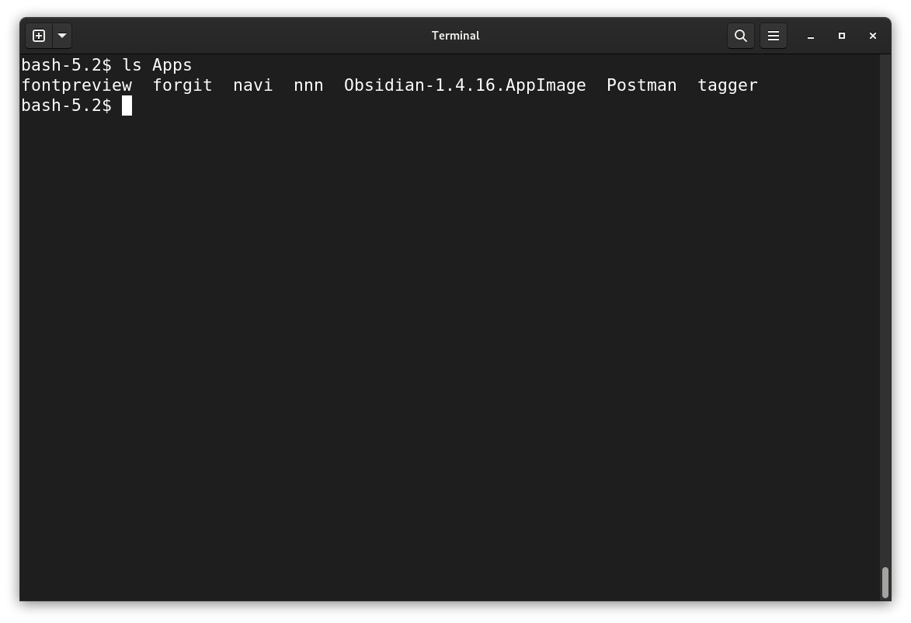
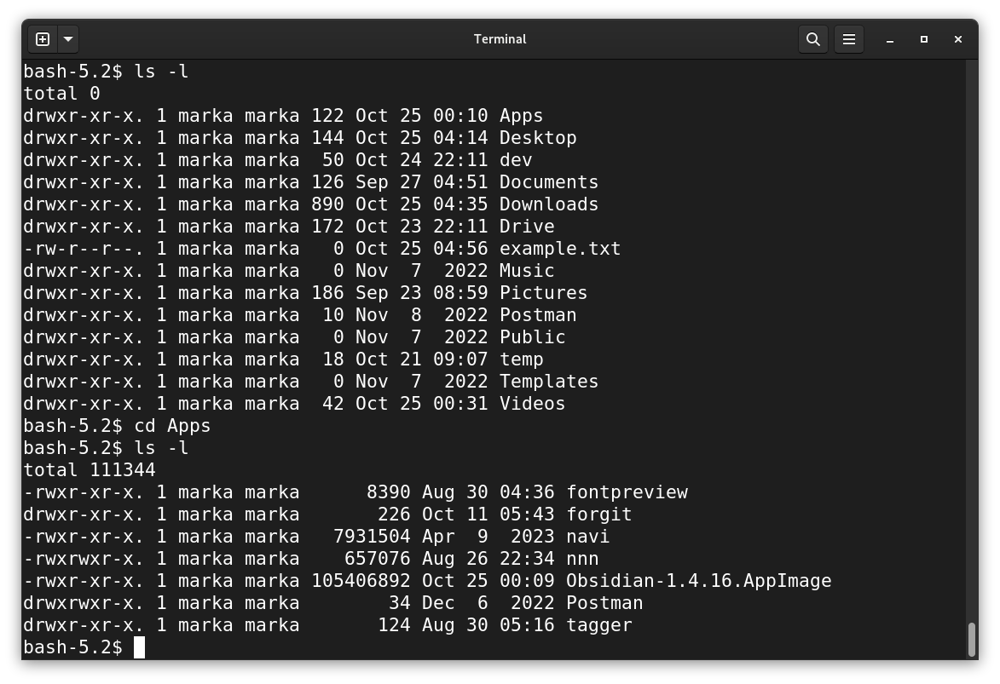
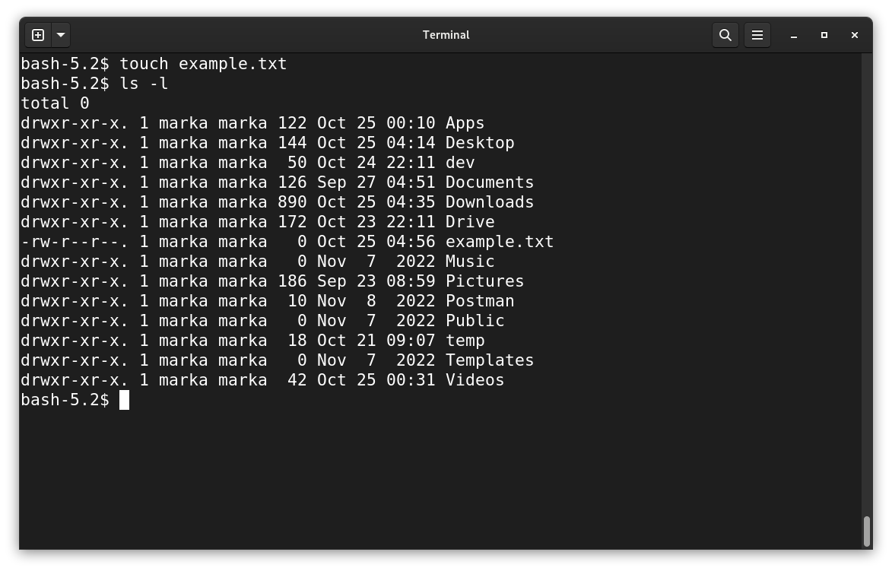
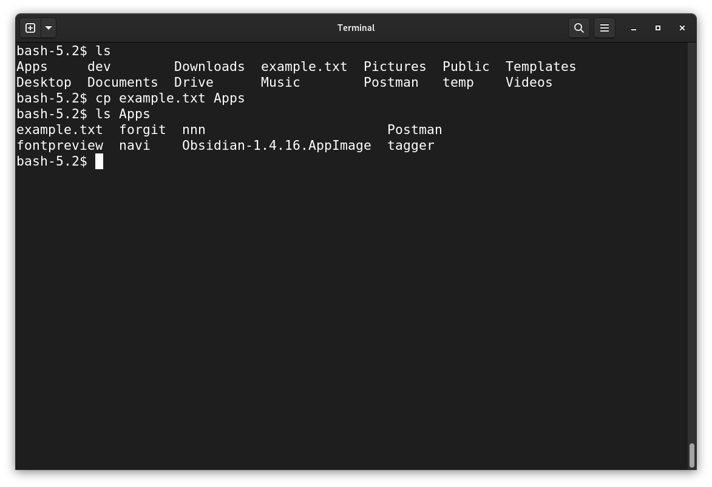

# Shell Basics

## Some terminology

We've so far used the terms *shell*, *command-line*, and *terminal* to talk about issuing commands to a machine. These terms are sometimes used interchangeably. In general (and throughout this work), they are differentiated and defined and follows:

- shell - the actual tool used to issue commands to a machine
- terminal - an *emulator* a shell runs in. On modern computers, to use a shell, in almost all cases a terminal will be opened
- command line - a more generic term for doing things in a terminal-like environment, i.e. without a GUI and mouse

## Absolute basics / first steps

A natural starting point for using a shell is *file operations* - creating, copying, moving, deleting, or otherwise manipulating files and directories on a system; all computer users have performed these operations. We'll see how they're done on the shell.

### Viewing

After opening a terminal, `ls` is a natural first command. `ls` lists the contents of the current directory, which in our case will usually be the [home directory](nolink) when first opening a terminal.

```bash
ls
```


With this, we see all contents of the (current) directory: `$HOME`

Another variation is this one, which uses a [flag](nolink) (the "-l" flag) to list a `l`onger version of the same contents, with more details:

```bash
ls -l
```



You can provide `ls` a path and it will show the contents of *that* path rather than the current path / directory.

```bash
ls Apps
```



### Changing directories

```bash
cd {some_directory}
```



After changing the directory, we see that the contents reflect that change.

### Creating / Copying

Let's copy a file to another location, but first, let's create one. This is done with `touch {filename}`, where `{filename}` is any name we choose.

```bash
touch example.txt
```



We create the file, and confirm we created it with another invocation of the `ls` command.

Now, let's copy the file:

```bash
cp example.txt Apps
```

