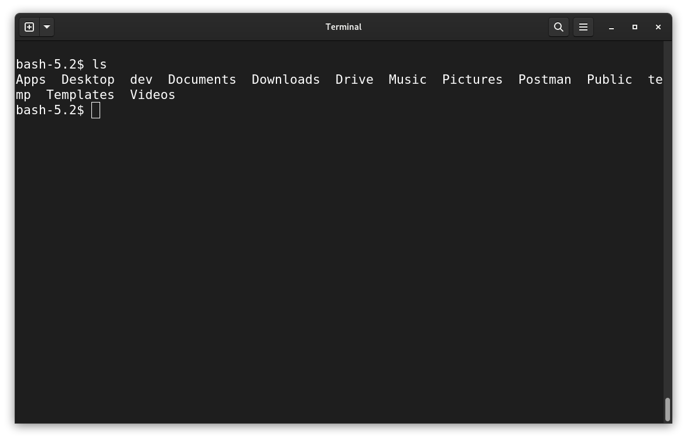

# Shell Basics

## Some terminology

We've so far used the terms *shell*, *command-line*, and *terminal* to talk about issuing commands to a machine. These terms are sometimes used interchangeably. In general (and throughout this work), they are differentiated and defined and follows:

- shell - the actual tool used to issue commands to a machine
- terminal - an *emulator* a shell runs in. On modern computers, to use a shell, in almost all cases a terminal will be opened
- command line - a more generic term for doing things in a terminal-like environment, i.e. without a GUI and mouse

## Absolute basics / first steps

A natural starting point for using a shell is *file operations* - creating, copying, moving, deleting, or otherwise manipulating files and directories on a system; all computer users have performed these operations. We'll see how they're done on the shell.

### Viewing

After opening a terminal, `ls` is a natural first command. `ls` lists the contents of the current directory, which in our case will usually be the [home directory](nolink) when first opening a terminal. 

```shell
ls
```

```javascript
let awesome = "this is working";
```



