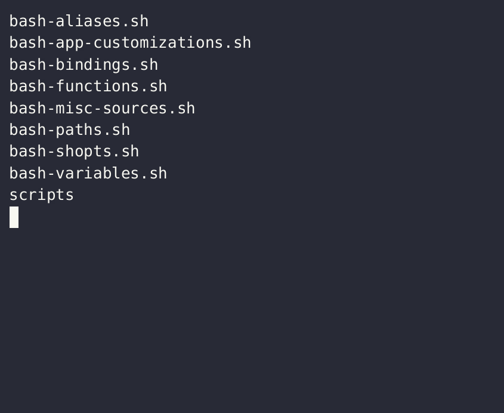
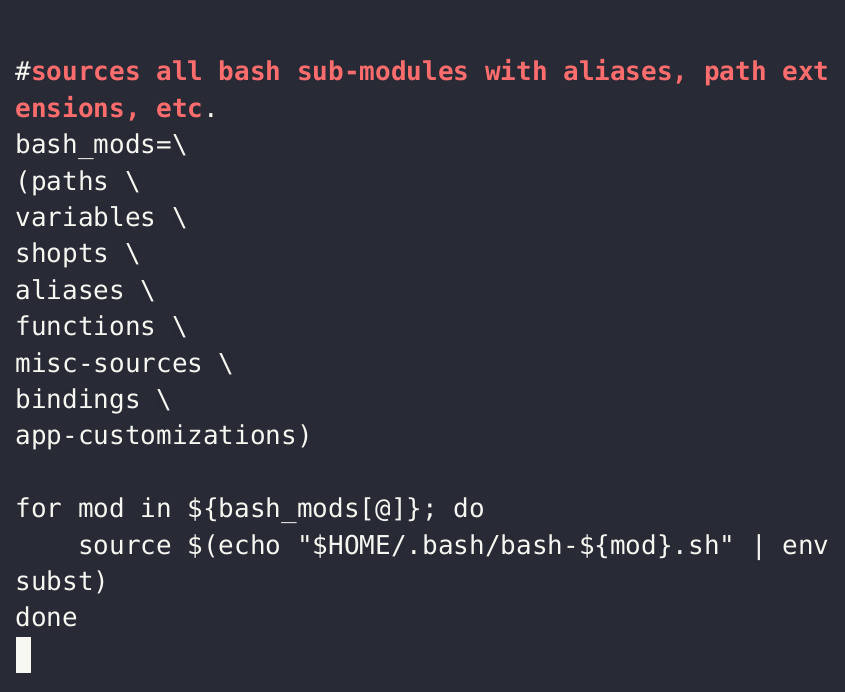

# Sourcing

To *source* a file is to bring it into the calling shell's scope; it can be done with either of the following functionally identical commands:

`source {somefile}`

`. {somefile}`

> while simply preceeding the filename with the dot (`.`) operator does work, the former syntax is more readable and thus may be preferable

## A Useful Pattern for Sourcing

You may wish to leverage sourcing in order to *modularize* any file / set of files. For instance, if you keep all bash customizations in your `.bashrc` file, it can become cluttered. Consider creating a directory (perhaps `mkdir ~/.bash/`?) where you store multiple {bash-something} files, then simply sourcing them all in your `.bashrc` file:

`ls -1 ~/.bash/`

and, in your `.bashrc` file:

