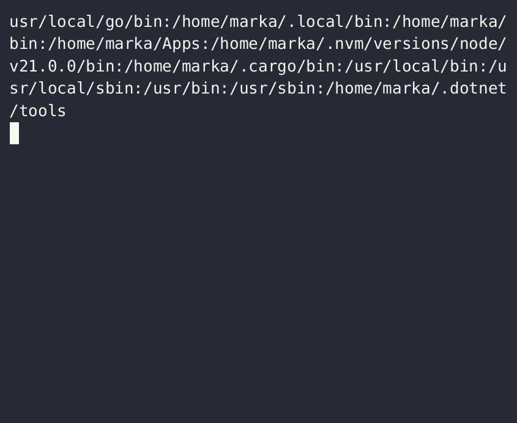
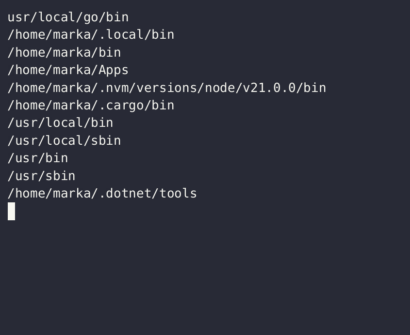

# The `$PATH` variable

Every command we invoke is located somewhere; for a given command, location can be identified with `which`:


We can use the `ls` command by typing the *full path to it*, `/usr/bin/ls`. However, we can also just type `ls`, and bash knows how to find the `ls` command. This is possible due to the `$PATH` variable.

## `$PATH`: explained

`$PATH` is an *environment variable* that represents multiple *paths* where the operating system should look for commands to run. `$PATH`is simply a string of *paths* separated by *colons*:

`echo $PATH`



> the output is easier to understand if we put each path on its own line:

`echo $PATH | tr ':' '\n'`



If we want to use a command without typing its full path, we either put that command in a directory that is already in the `$PATH` variable, or we add its directory to `$PATH` - this is done by redefining `$PATH` as the new value plus all the old values:

`export PATH="/some_new_directory:$PATH"`

> we must `export` the new (updated) value of `$PATH`; alternatively, we define path additions in a separate file and [source](../pages/sourcing.md) it. Example - a file named `path-additions.sh` with contents:

```bash
PATH="$HOME/Apps:$PATH"
PATH="$HOME/bin:$PATH"
PATH="$HOME/.local/bin:$PATH"
PATH="$HOME/Apps/forgit/bin:$PATH"
PATH="/usr/local/go/bin:$PATH"
```

> notice that each addition to the path is on its own line, and the absence of the `export` keyword

with a file like the one above, we could write a line like this in our `.bashrc` file to make the path additions permanent:

`source /path/to/path-additions.sh`