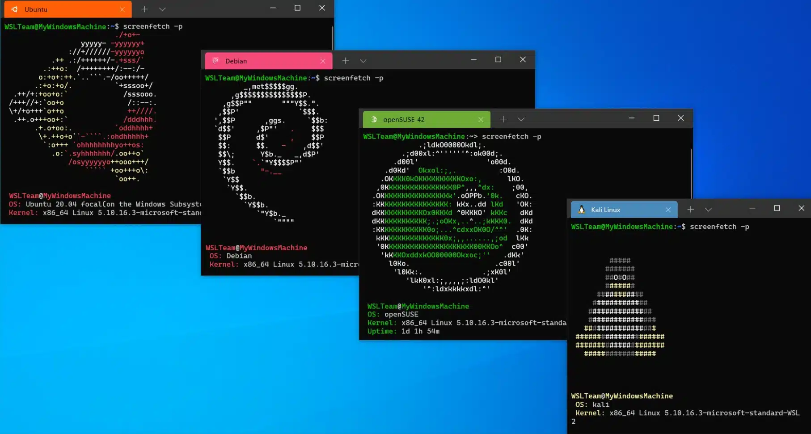

# WSL

*WSL*, or *Windows Subsystem for Linux*, is a compatability layer for Windows that allows running a full, first-class Linux natively (without the use of virtual machines, hacks, etc). This results is a more seamless, performant Linux experience on Windows, with many distros being compatible.

For users that prefer (or must use) Windows, WSL allows a solid out-of-the-box Linux experience, with all bells and whistles.

## Recommended Setup

TODO (shortcuts, easy access via file explorer, how to back things up, etc.)