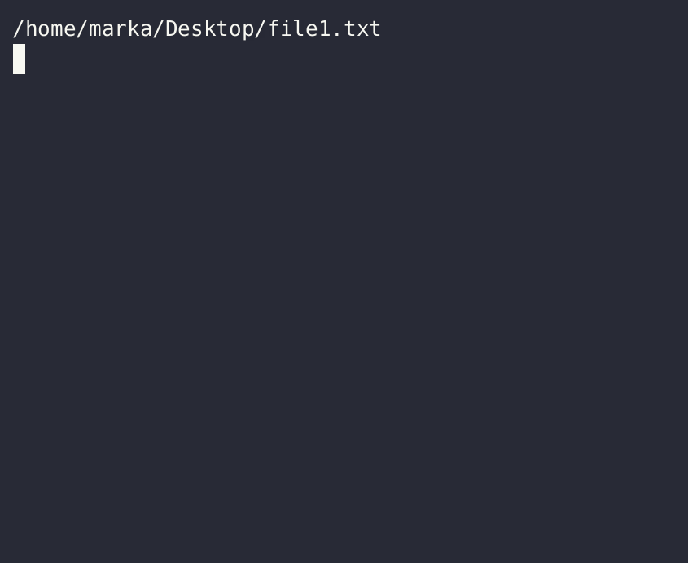
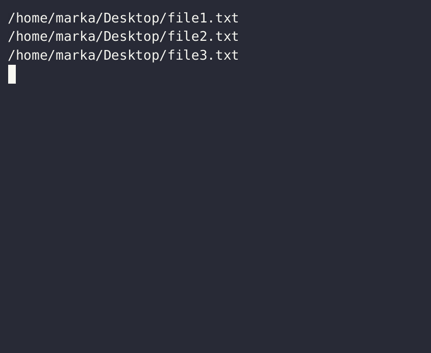

# Xargs

`xargs` is found on most Unix-like operating systems, and is one of the most powerful command-line tools. If you have multiple *things*, and you want to *do something* to *each* of those things, you can do so with `xargs`

# The xargs pattern:

> often, it's conventional to `find` items to process before using xargs to process them. Read about `find` first [here](find.md) if you haven't already

> `xargs` also makes heavy use of pipes; read about [them](pipes.md) first too if you haven't, then return here

The *find-xargs* pattern is very common, and very useful. We `find` some files and / or directories, then we can *do* something to them with `xargs`. The core syntax approach is:

`find /some/location [options] | xargs {cmd} [options]`

this is, "look [in] *some location* for *files and / or folders*; then, and *do something to them* using some *command* {cmd}"

# Examples

## pairing `xargs` with `find`

### get full paths for all text files in current directnory

`find * -type f -iname "*.txt" | xargs readlink -f`

### "." vs "*" vs "/" in a `find` construct

see the [find subsection](find.md#location--vs--vs--in-a-find-construct) explaining this

## grokking other `xargs` concepts

### "all as arguments" vs "each as single argument" 

consider the `readlink` command in three contexts:

`readlink -f file1.txt`

`readlink -f file1.txt file2.txt file3.txt`

`files=(file1.txt file2.txt file3.txt); for file in ${files[@]}; do readlink -f \"${file}\"; done`

- the command works with one argument
- the command works just as well with multiple arguments 
- the command also works within a looping construct; the output is identical to the output of the second approach

The third approach (looping constructs) *always* works with this type of pattern; it's entirely generic. The first approach always works - any command that accepts a file as an argument is going to work if you only pass one file as an argument!

The second approach is trickier; some commands support multiple / indefinite arguments at the end, some do not.

How does this relate to `xargs`? You write xargs constructs differently depending on whether a command supports multiple trailing arguments like this or not. Let's see a failing case:

`find * -maxdepth 1 -type f -iname "*.txt" | xargs cp ./new_dir/`

`find` gets all text files in the current directory and passes them to `xargs`, which tries to copy them all to the `new_dir` directory.

Why specifically does this fail? When these values get passed to `xargs`, it expands everything like this before running the actual `cp` command:

`cp ./new_dir file1.txt file2.txt file3.txt file4.txt file5.txt`

This is not what we intended; the *last* argument of copy is the destination, but our destination is not understood to be the final argument. `cp` has a solution for this - *explicitly* marking the `new_dir` directory as the *target* by using the `-t` flag before it. Doing this helps `xargs` understand that all the files we pipe in are *things to copy*, and `new_dir` is the *target* to copy them *to*. The command works now:

This pattern of including the `-t` flag works for `cp`, but there are some commands that *only work* when a single argument is passed. Can we still get multiple items with `find` and use them all with `xargs` in this case? Yes we can; there is a general pattern that makes `xargs` compatible with these types of commands:

`find * -maxdepth 1 -type f -iname "*.txt" | xargs -I {} cp "{}" -t ./new_dir/`

This more general approach will work in more cases; observe that we passed an `-I` flag with the argument `{}`; this flag (and argument) allow us to *substitute in* a value in our command that is located right where the actual file argument would be. Now `xargs` is told exactly where to put each argument, puts each argument there, and runs the command for every single argument. Everything works. Hopefully this has helped you understand how to get `xargs` to play nicely with different kinds of commands. In short:

> for commands that can only handle single arguments, use the `-I` flag and a substitute value like `{}`

> for commands that handle multiple arguments well, piping to `xargs` can be done without this flag.

### handling problematic characters / spaces / etc.

> this is part of a much larger set of problems you need to solve when working on the command line - for full details, see the page on [handling shell expansion(s)](anatomy-of-problematic-shell-expanions-and-how-to-deal-with-them.md).

#### Strategy 1 - Double-quote for proper expansions

A common cause for xargs failures (and shell failures in general) is the improper handling of spaces. The short version: spaces can be part of directory names or file names, but are *also* the primary way shells separate <mark>words</mark>...TODO

#### Strategy 2 - Null-terminated sequences

### shorthand - alternate syntax

TODO